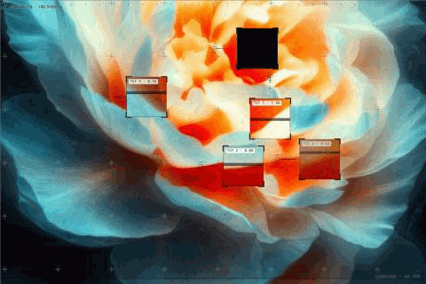
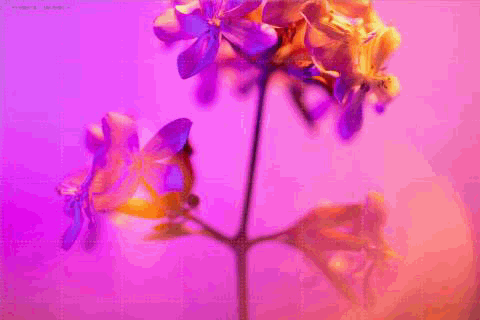
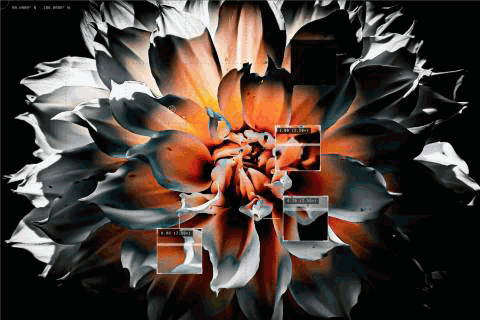
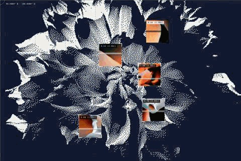
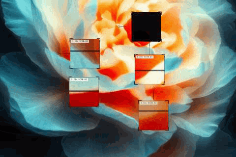
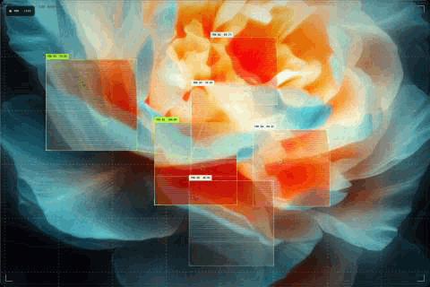
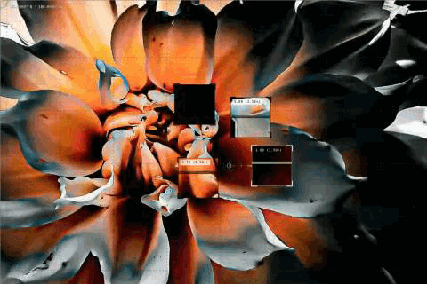
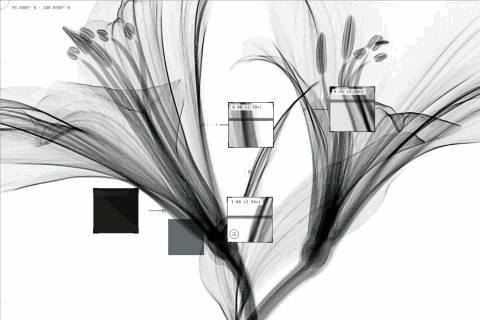
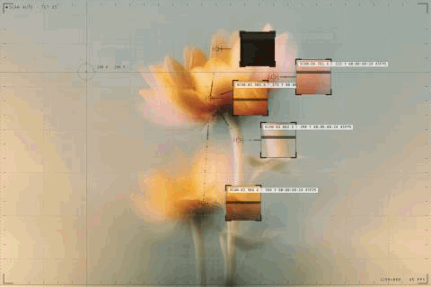

<div align="center">

# Grid Pulse Scan Pro

**Turn any image or video into an interactive tactical scanner.**

A dependency-free React + Canvas component combining two Framer marketplace
concepts — *Grid Pulse Scan* and *Specimen* — in one engine: real-time feature
detection, magnified callouts, tracked inspection frames, six media effects,
eleven presets, and a full scientific-HUD renderer on top.



*Hover the media and the instrument wakes — an acquisition sweep crosses the
stage, reticle designators lock on with rotating rings, magnified callouts
unfold behind leader lines, and the HUD frame streams live telemetry from its
corners.*

`111/111 tests` · `5/5 quality floors` · `~90 committed browser captures` ·
`9 defects found & fixed by instruments` · `zero runtime dependencies`

</div>

---

## Everything, in motion

Every GIF below was recorded from the real component running in Chromium by
[`tools/record-gifs.mjs`](tools/record-gifs.mjs) — nothing is mocked.

### Click to rescan
Click anywhere: the current detection set fades through a blackout gap, a new
scan commits, and the focused point lands **exactly** where you clicked.


### Three detection modes
`auto` blends structure and person signals, `person` weights skin regions
(with native `FaceDetector` when the browser has one), `detail` chases edges
and texture. Deterministic per seed — same media, same points.



### Six media effects
`none → bitmap → pixelated → code → xray → thermal`, applied to the media,
the callouts, or both. All parameterized: dither matrices, glyph sets, edge
weights, tone curves, false-colour ramps.



### Floyd–Steinberg dither palettes
`bitmapMethod: "diffusion"` with five named palettes — `duotone`, `mono4`,
`handheld`, `amber`, `cmyk` — plus threshold, ordered-Bayer, and halftone
methods.



### Eleven engine presets
One prop: `preset="loupe"`. Loupe, telemetry, plate, survey, lattice, contour,
hairline, swarm, field, viewfinder, tracking — each a distinct instrument
built from public options, so every one is reproducible by hand.



### Ten Specimen scenes
The integrated renderer layers a scientific-vision system on the engine:
tracked inspection frames, scene graph meshes, acquisition choreography,
typed labels, HUD, film finish, GPU post-processing with automatic fallback
and adaptive quality.



### Video with stable tracking
Video plays through the same pipeline. Identities persist across re-scans —
the tracker solves exact minimum-cost assignment up to 12 points and greedy
nearest-first up to 80.



### Adaptive chrome
The chrome samples the media and picks its own ink — dark lines on a white
X-ray plate, light on a black dahlia, per-zone and per-point. On by default,
because white-on-white was a real failure a real photo caught.



### Crosshair + live telemetry
A frame-rate-independent crosshair follower (95 ms to 99% of the gap,
measured within one frame of that) with lat/lon, percent, or pixel readout — and label chips
streaming `{score} {id} {coords} {time} {zoom} {mode} {pct} {index} {n} {x}
{y} {label} {fps}`.



---

## Quick start

```bash
npm ci
npm run dev       # demo at http://localhost:5173 — both renderers, all presets
npm run verify    # typecheck + 111 tests + lint + inventory + quality floors
```

## Use it

```tsx
// The integrated Specimen renderer (default export)
import SpecimenGridPulse from "./src/GridPulseScanPro"

<SpecimenGridPulse src="/media/clip.mp4" preset="Feature Tracking"
    style={{ width: "100%", height: 560 }} />
```

```tsx
// The Grid Pulse engine
import { GridPulseScan } from "./src/GridPulseScanPro"

<GridPulseScan
    src="/media/portrait.jpg"
    preset="telemetry"                       // or any of the 11
    detection={{ mode: "detail", pointCount: 6 }}
    effect={{ type: "thermal", scope: "media" }}
    interaction={{ activation: "hover", clickToRescan: true }}
    style={{ width: "100%", height: 560 }}
/>
```

**In Framer:** paste [`src/GridPulseScan.framer.tsx`](src/GridPulseScan.framer.tsx)
(engine — mirrors the reference component's control set) or
[`src/GridPulseScanPro.framer.tsx`](src/GridPulseScanPro.framer.tsx)
(Specimen renderer) into a code file along with `src/`. Full property
controls: media, scene/preset, detection, effects, all 8 aspect ratios,
mirror, activation, chrome. Typechecked against the published `framer` types.

Full API: [docs/COMPONENT.md](docs/COMPONENT.md).

## Capability sheet

| | |
| --- | --- |
| **Detection** | auto / person / detail / custom · native FaceDetector with saliency fallback · deterministic seeds · focus bias · click-focused rescan · up to 80 points · custom detector hook |
| **Tracking** | stable identity assignment (exact ≤12, greedy ≤80) · velocity prediction · temporal smoothing · lost-frame coasting · video re-acquisition |
| **Callouts** | magnified zoom boxes or Specimen tracking frames · overlap avoidance · corner brackets · scan sweeps (4 directions, 3 modes) · acquire/unfold/pop choreography · parallax |
| **Chrome** | instrument HUD (viewport brackets, edge rulers, live readouts, status dot, full-stage acquisition sweep) · registration-cross or ruled grid, animated (dash/drift/pulse/scan) · leader + point-to-point connections (nearest/chain/hub) with tick marks · reticle markers with rotating lock rings · crosshair with 3 coordinate styles · 13 label tokens, 4 time formats · adaptive light/dark chrome, regional zones, halo |
| **Effects** | bitmap (threshold/ordered/halftone/diffusion + 5 palettes) · pixelated · code glyphs · x-ray · thermal (3 ramps) · media/boxes/both scoping · throttled video refresh · graceful cross-origin degradation |
| **Specimen layer** | 10 scenes · scene-graph meshes (nearest/mst/mesh) · ghost nodes · scan waves · typed labels · renderer profiles · lens optics · film finish · HUD · preset rail · plugin phases · WebGL2 post-processing with software-GL detection and adaptive quality tiers · MediaRecorder capture controller |
| **Interaction** | hover / always / tap · touch models (auto/tap-toggle/press-hold/rescan) · keyboard (Enter/Escape) · click-to-rescan · auto-rescan interval · reduced-motion support |
| **Media** | image + video (rVFC) · 8 aspect ratios · mirror · object-fit + focal point · DPR cap · demand-driven render loop · offscreen pause |
| **Integration** | imperative render bridge (per-frame snapshots, canvases, points) · Framer wrappers · 11 preset bundles · full TypeScript surface (266 options, 116 exported types) |

## The parity programme, honestly

This repo implements the exact-parity programme in
[docs/PARITY-PLAN.md](docs/PARITY-PLAN.md) against the paid references. Read
[docs/FINAL-REPORT.md](docs/FINAL-REPORT.md) first — the short version:

- **Scope (A): 10/10 rows pass**, browser-exercised. **Non-regression (D):
  zero FAILs.** Convergence (§8.2) met — two consecutive zero-finding
  iterations on the final build.
- **Visual/behavioural fidelity vs the reference (B, C): unverifiable here
  and honestly left unscored** — the reference's hosts are refused at this
  environment's egress proxy (proven with curl *and* a real Chromium). Our
  half of every comparison is measured and committed
  ([docs/MEASURED-TIMINGS.md](docs/MEASURED-TIMINGS.md)); supply reference
  captures at 1200 px / DPR 2 and scoring is immediate.
- Nine real defects were found by instruments and fixed with before/after
  measurements — including a render loop that froze permanently at 6 frames,
  white-on-white chrome on light media, and an adaptive-quality system that
  couldn't rescue a 12× budget collapse (now ~150× faster where it matters).
  Full log: [docs/PARITY-LOG.md](docs/PARITY-LOG.md).

## Docs

| File | Contents |
| --- | --- |
| [FINAL-REPORT.md](docs/FINAL-REPORT.md) | The programme's closing deliverable — start here |
| [COMPONENT.md](docs/COMPONENT.md) | Full API reference |
| [PARITY-PLAN.md](docs/PARITY-PLAN.md) | The original programme brief, verbatim |
| [SCORECARD.md](docs/SCORECARD.md) · [parity-score.json](docs/parity-score.json) | Every rubric row and its evidence |
| [MEASURED-TIMINGS.md](docs/MEASURED-TIMINGS.md) | Our side of every behavioural timing, browser-measured |
| [MEDIA-TESTS.md](docs/MEDIA-TESTS.md) | 4 real photos × 10 scenarios, with findings |
| [BASELINE.md](docs/BASELINE.md) · [PARITY-LOG.md](docs/PARITY-LOG.md) | Metrics history and the 25-iteration log |
| [UNREACHABLE.md](docs/UNREACHABLE.md) | What cannot be verified here, and exactly why |
| [ENHANCEMENTS.md](docs/ENHANCEMENTS.md) · [FEATURE-INVENTORY.json](docs/FEATURE-INVENTORY.json) | Version history and the machine-checked inventory |

## Repository

```
src/GridPulseScanPro.tsx          the only public entry point (both renderers)
src/*.framer.tsx                  Framer code-component wrappers
src/grid-pulse/                   engine + Specimen renderer + vision framework
src/demo/                         demo app, v2.8 playground, capture app
test/                             12 suites, 111 checks (node --test, no build step)
tools/                            lint · inventory · quality floors · harnesses ·
                                  browser capture/behaviour/hardening/timing/GIF instruments
docs/                             the full evidence trail (captures, gifs, reports)
```

Nothing outside the entry point imports from `src/grid-pulse/` — a test
enforces it. Every number in every doc was produced by a committed tool.
